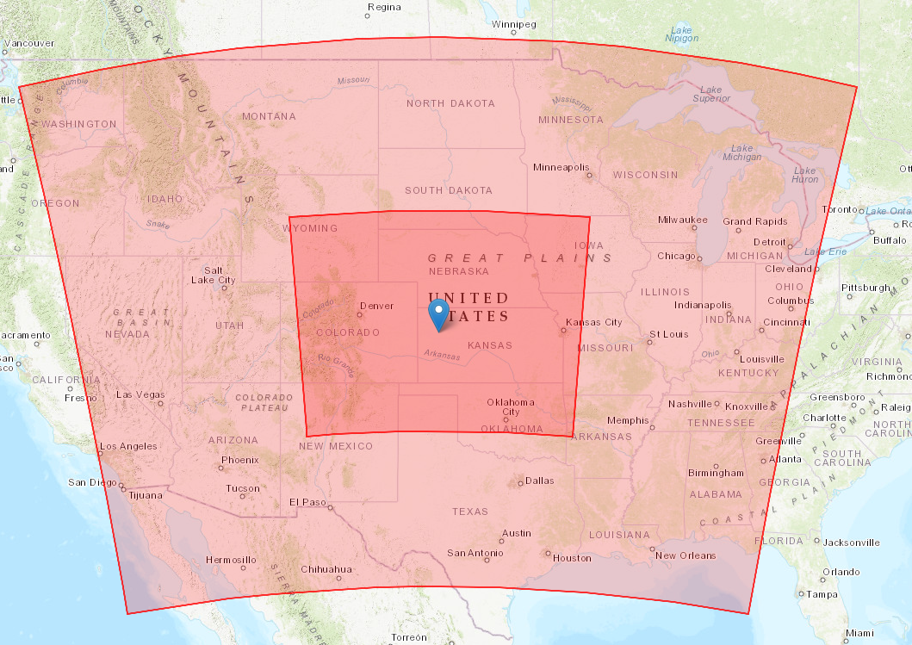

# Experimental Setup

The experiment simulates and assimilates atmospheric data over a multi-day period using a nested domain setup. 

### Time Configuration
*   **Initial Date:** July 13, 2015, 00:00 UTC
*   **Final Date:** July 15, 2015, 12:00 UTC
*   **Spin-up Time:** 6 hours

### Domain & Grid Specifications
The model utilizes a Lambert Conformal projection centered at 39.0°N, -101.0°W (true latitudes: 32.0° and 46.0°). While parameters for a third domain exist in the configuration, the run is explicitly restricted to two active domains (`MAX_DOM=2`) with 51 vertical levels and a model top of 1500 Pa.

| Attribute | Domain 1 (Parent) | Domain 2 (Nest) |
| :--- | :--- | :--- |
| **Grid Dimensions (W-E x S-N)** | 212 x 160 | 411 x 321 |
| **Grid Spacing** | 15 km | 3 km |
| **Time Step** | 30 seconds | Configured by ratio |
| **Geographic Data** | MODIS 30s | MODIS 30s |

<p align="center">
  
</p>

### Physics Options
The simulation relies on the following parameterization schemes across both domains:
*   **Microphysics:** Thompson (`mp_physics = 8`)
*   **Radiation (LW/SW):** RRTMG (`ra_lw_physics = 4`, `ra_sw_physics = 4`)
*   **Surface Layer:** Eta similarity (`sf_sfclay_physics = 2`)
*   **Land Surface:** Noah Land Surface Model (`sf_surface_physics = 2`) with 4 soil layers
*   **Planetary Boundary Layer:** Mellor-Yamada-Janjic (MYJ) (`bl_pbl_physics = 2`)
*   **Cumulus:** Kain-Fritsch on Domain 1 (`cu_physics = 1`); explicitly turned off for the 3km Domain 2.

## Data Assimilation (DART) Setup

The assimilation cycle employs an Ensemble Adjustment Kalman Filter (EAKF) driven by DART, interacting with the WRF state. 

*   **Ensemble Size:** 50 members
*   **Assimilation Interval:** 3 hours for standard state variables
*   **Radar Assimilation Frequency:** 15 minutes
*   **Inflation:** Adaptive inflation is enabled (`ADAPTIVE_INFLATION=1`)
*   **Initial Perturbation Scale:** 0.25 
*   **Assimilated Variables (18 total):** `U`, `V`, `PH`, `THM`, `MU`, `QVAPOR`, `QCLOUD`, `QRAIN`, `QICE`, `QSNOW`, `QGRAUP`, `QNICE`, `QNRAIN`, `U10`, `V10`, `T2`, `Q2`, `PSFC`


## Repository Scripts & Architecture

This repository implements a complete WRF-DART ensemble data assimilation cycling system, including data acquisition, initial and boundary condition generation, observation processing, ensemble forecasting, assimilation, diagnostics, and visualization utilities.

Below is a summary of the major scripts and directories and their roles within the experiment workflow.

### Core Configuration

* **`param.sh`**
  The master configuration file for the entire experiment. It defines:

  * Experiment start and end dates
  * Assimilation frequency and cycling intervals
  * Number of ensemble members
  * Domain configurations
  * Directory paths
  * Scheduler and computational resource settings
  * Environment variables and module configurations

  Scripts source this file at runtime, making it the central location for modifying experiment parameters.
---

### Data Acquisition

* **`download_prebufr.sh`**
  Downloads real observation Prebufr data required by the experiment.

* **`download_era_5_pl.py`**
  Downloads ERA5 pressure-level reanalysis data from the Copernicus Climate Data Store (CDS).

* **`download_era_5_sf.py`**
  Downloads ERA5 single-level and surface fields needed for generating model initial and boundary conditions.

---

### Initial and Boundary Condition Generation

* **`gen_icbc.sh`**
  Main driver script responsible for generating initial condition (IC) and boundary condition (BC) files for the experiment.

* **`gen_init.ksh`**
  Generates perturbed initial ensemble members. It utilizes WRFDA's `randomcv` utility to create random perturbations that represent analysis uncertainty and provide ensemble spread.

---

### Observation Processing

* **`make_obs.ksh`**
  Main observation generation driver. Creates DART-compatible observation sequence files from either synthetic observations or real observational datasets.

* **`sys_temp_obs.py`**
  Generates synthetic temperature observations used in observing system simulation experiments (OSSEs).

* **`extract_wrf_obs_earthwind_ObsError2.py`**
  Extracts model state variables from WRF output and converts them into DART observation-space quantities while assigning observation error statistics.

* **`filter_obs.py`**
  Applies quality control procedures and filters observations according to user-defined criteria before assimilation.

* **`gen_obs.sh`**
  General observation generation workflow that coordinates observation extraction and DART observation file creation.
  
---

### Ensemble Forecasting and Data Assimilation

* **`ensemble_fcst.sh`**
  Executes ensemble forecasts across compute nodes. Handles model initialization, parallel execution of ensemble members, and forecast management.

* **`advance_run.sh`**
  Advances the assimilation cycle by updating simulation times and preparing the next forecast-assimilation window.

* **`run_cycle.sh`**
  Primary experiment driver. Coordinates the complete cycling workflow, including:

  1. Ensemble forecasting
  2. DART assimilation
  3. Ensemble updates
  4. Transition to the next cycle

* **`da_run_wrfvar.ksh`**
  Executes WRFDA first-guess and data assimilation procedures.

* **`run_mode.ksh`**
  Driver script for running MODE verification and object-based diagnostic analyses.

---

### Repository Entry Points

For this experiment, the typical execution sequence is:
```text
param.sh
   ↓
gen_icbc.sh
   ↓
gen_init.ksh
   ├──→ da_run_suite_wrapper.ksh
   ├──→ da_set_defaults.ksh
   ├──→ da_perturb_wrf_bc.ksh
   ├──→ da_run_wrfvar.ksh
   ├──→ da_run_update_bc.ksh
   ├──→ da_run_wpb.ksh
   ├──→ da_run_job.ksh
   └──→ da_perturb_wrf_ic.ksh
   ↓
ensemble_fcst.sh
   └──→ advance_run.sh
   ↓
gen_obs.sh
   ├──→ Synthetic observations using prepbufr observation locations and meta data
   │      ├──→ prepbufr.csh
   │      ├──→ filter_obs.py
   │      ├──→ extract_wrf_obs_earthwind_ObsError2.py
   │      └──→ make_obs.ksh
   └──→ Synthetic observations, manally setting observation locations and meta data.
          ├──→ sys_temp_obs.py
          ├──→ extract_wrf_obs_earthwind_ObsError2.py
          └──→ make_obs.ksh
   ↓
run_cycle.sh
   └──→ advance_run.sh
```

## Best Practices & Directory Setup

To avoid file quota limits and ensure optimal read/write speeds, all outputs and intermediary files should be generated in a high-performance scratch space. 

**Recommended Setup:**
Create an `osse_out` directory within your primary scratch space (e.g., `/gpfs/home/<user>/scratch/tqprof/run2/osse_out`). Within this output directory, the pipeline will automatically generate necessary subdirectories (such as `dart_cycle`, `ens_fcst`, `ens_icbc`, `sys_obs`, and domain-specific DART folders) to keep the initial state data, ensemble members, and analysis outputs strictly isolated

